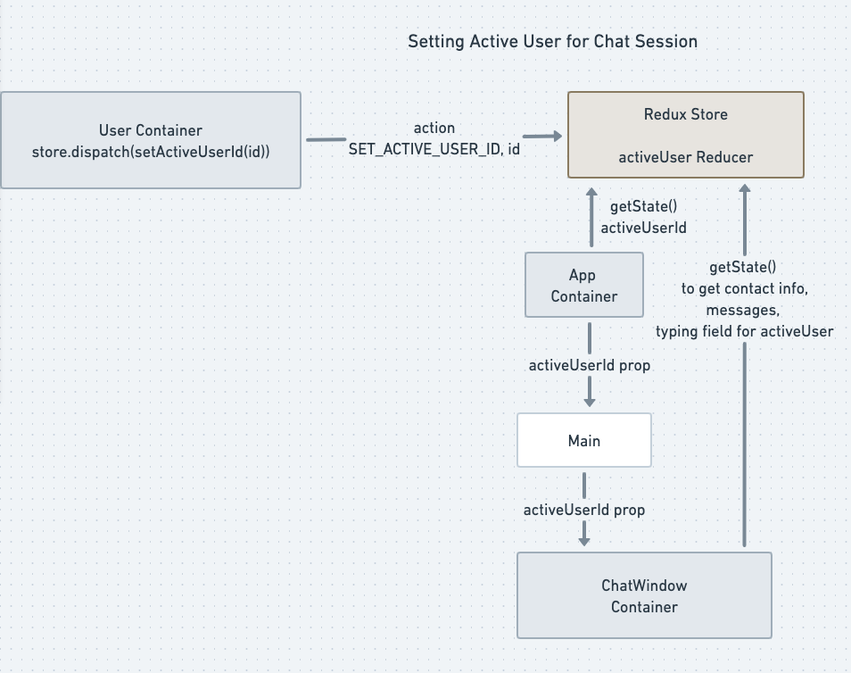

# Skipey Chat Application

Try the React application here: [Skypey](https://christinesalim.github.io/Skypey/)


A React.js + Redux project that displays a user's chat sessions, allows the user to send a chat message to a contact, delete a contact, and edit or delete previous messages. The Skipey application uses Redux for state management. The initial chats and user contacts displayed are fake test data generated by the Faker library. Similarly, avatars are generated by the random-avatar-generator library to display a profile for each user. On a production application, this data would be obtained via a REST API from a database.


## Container Components

The container components manage a slice of the application's state and pass it down to other components as props for rendering. These components access the Redux state store to read the current state and dispatch actions created by action creators to modify the state. Examples of container components include the App, User, MessageInput and ChatWindow.

## Other Components

These components render props passed down to them from container components using JSX and don't maintain any state themselves. For example, the Sidebar, Main, Header, Chats and Chat component are simple components used to display some state of the application.

## Redux State Store

The store manages several pieces of state:

- User data: name, profile, status
- Contacts list: a list of user's contacts including their name, profile, status
- Messages: a list of messages associated with each contact
- Active user: the current active user to send a message to
- Message: the message the user is typing

Whenever the state of the application changes after a reducer processes an action, the application re-renders itself. It subscribes to changes in the state managed by Redux.

```
//Update the app rendering whenever state in Redux store changes
store.subscribe(render);
```

## Action Creators



Action creators are used to generate actions that are handled by the reducer to modify the state in Redux's state store. For example, when someone clicks on a contact in the Sidebar to start a chat session, the User container component dispatches the SET_ACTIVE_USER_ID action to set that contact to be the active user. The Redux store has an activeUser reducer that updates the current active user. Similarly action creator are used to create actions to delete a contact, delete, edit and send a message, and set the typed message value. Below is an example of an action creator that generates the action to delete a contact.

```
export const setActiveUserId = id => ({
  type: SET_ACTIVE_USER_ID,
  payload: id,
});
```

## Reducers

The corresponding reducers: activeChatId, activeUserId, contacts, messages, user and typing handle the actions dispatched to the store. The reducers are combined to generate one state object to maintain the state of the chat application. The code below shows how the contactsReducer handles the action to delete a contact. It removes the contact for the userId it receives in the action's payload and returns a new state for the contacts with that user removed from the state object.

```
const contactsReducer = (state = contacts, action) => {

  switch(action.type){
    case DELETE_CONTACT:
      const contactId = action.payload;
      //Save the new list of contacts in newState after
      //excluding the contact to delete
    const { [contactId]: removed, ...newState} = state;
      //Return the updated contact list
      return newState;
    default:
      return state;
  }
};
```

## Getting Started with Create React App

This project was bootstrapped with [Create React App](https://github.com/facebook/create-react-app).

## Available Scripts

In the project directory, you can run:

### `npm install`

### `npm start`

Runs the app in the development mode.\
Open [http://localhost:3000](http://localhost:3000) to view it in your browser.
